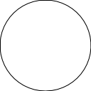

# moon
 
The moon package generates images of the moon in different phases.
 
The image can either be a simple two color image or can be a shaded image of the moon itself.
The image of the moon used is found at https://www.pexels.com/photo/photo-of-full-moon-975012/. 
 
The phase of the moon is represented by the numbers [-1.0..1.0].
The absolute value of the phase is the percent the moon is illuminated.
The sign of the phase determins if it is waxing (negative) or waning (positive).
A value of 0 is a new moon while 1 and -1 both are a full moon. 

# Exaples of both two color and photo images

| Phase | Name | Icon | Photo |
| --- | --- | --- | --- |
| 0.0 | New Moon |  |  |
| -0.25 | Waxing Moon |  |  |
| ±1.0 | Full Moon |  |  |
| 0.75 | Gibbous Moon |  |  |
