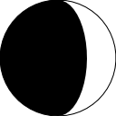
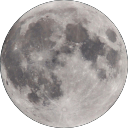

# moon
 
The Go moon package generates images of the moon in different phases.
 
The image can either be a simple two color image or can be a shaded image of the moon itself.
The image of the moon used is found at https://www.pexels.com/photo/photo-of-full-moon-975012/. 
 
The phase of the moon is represented by the numbers [-1.0..1.0].
The absolute value of the phase is the percent the moon is illuminated.
The sign of the phase determines if it is waxing (negative) or waning (positive).
A value of 0 is a new moon while 1 and -1 both are a full moon. 

# Example

```go
package main

import (
	"fmt"
	"image"
	"image/png"
	"os"

	"github.com/pborman/colors/web"
	"github.com/pborman/moon"
)

func makeIcon(path string, size int, phase float64) {
	img := image.NewRGBA(image.Rect(0, 0, size, size))
	// Draw a moon with the visible part white onto img.
	moon.FillMoonIcon(img, web.White, web.Black, phase)
	// Draw the outline of a full moon in black onto img.
	moon.StrokeMoonIcon(img, web.Black, web.Transparent, 1)

	fd, err := os.Create(path)
	if err != nil {
		fmt.Fprintln(os.Stderr, err)
		return
	}
	png.Encode(fd, img)
	fd.Close()
}

func makePhoto(path string, size int, phase float64) {
	// Get a photo of the moon with the no-visible part being 33% illuminated.
	img := moon.Draw(size, phase, .33)
	fd, err := os.Create(path)
	if err != nil {
		fmt.Fprintln(os.Stderr, err)
		return
	}
	png.Encode(fd, img)
	fd.Close()
}

func main() {
	makeIcon("moon-new.png", 128, 0)
	makeIcon("moon-waxing-crescent.png", 128, -0.25)
	makeIcon("moon-waning-gibbous.png", 128, 0.75)
	makeIcon("moon-full.png", 128, 1)

	makePhoto("moon-photo-new.png", 128, 0)
	makePhoto("moon-photo-waxing-crescent.png", 128, -0.25)
	makePhoto("moon-photo-waning-gibbous.png", 128, 0.75)
	makePhoto("moon-photo-full.png", 128, 1)
}
```

# Resulting images

| Phase | Name | Icon | Photo |
| --- | --- | --- | --- |
| 0.0 | New Moon |  |  |
| -0.25 | Waxing Moon |  |  |
| ±1.0 | Full Moon |  |  |
| 0.75 | Gibbous Moon |  |  |
